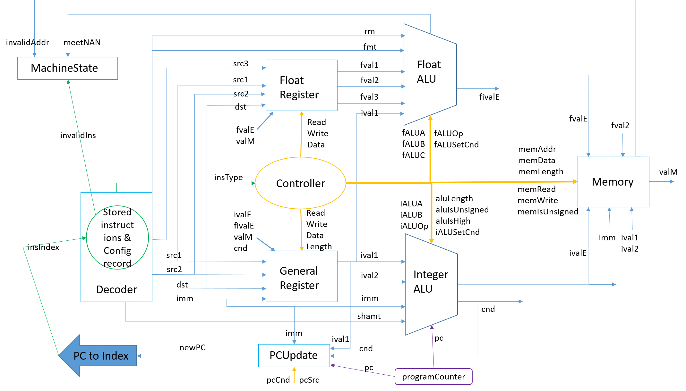

# RISCVSimulator

Simple pluggable RISCV64IMF simulator, works on Linux.

## For Contributors

To initialize your workspace after your first `git clone` operation, use __init.sh__.

## 安装程序

运行init.sh初始化工作区，之后运行`compile.sh`以完成编译安装。推荐在完成编译之后将riscv-toolchain中附带的`objdump`程序复制到`tools/`文件夹。（程序包中附带的objdump程序可能与特定的系统不兼容）

## 程序功能简述

1. 实现RISCV-IMF指令集

2. 实现系统调用

3. 调试功能（断点，单步调试，运行程序，控制台，查看寄存器、内存、符号表，修改寄存器、内存）

4. 指令添加：只需要修改对应的config文件，添加指令的数据通路

5. 可插接的模拟器实现：用户实现一组CombineLogic类，实现MachineController类即可改变模拟器的具体实现。

6. 可插接的系统调用实现：用户实现一组Syscall类，并在config文件中注册系统调用即可使用自己的系统调用实现。

## 使用程序

利用`run.sh`运行程序。

进入程序时，程序显示如下图：


加载ELF文件后，程序显示如下图，此时PC指向第一行代码（如黄色箭头所示），第10行被添加了一个断点（如红色球所示）。在此界面上按上/下方向键可以翻动代码（每次一行），或者PageUP/PageDown（每次一页），或使用鼠标滚轮（默认每次三行，可定制）。用户可以单击行号左边的区域来添加/删除断点。


在控制台界面，用户可以在下方的标准输入框中编辑文字，并使用Ctrl+Enter命令提交输入到上方的标准输出框。它们分别与程序的标准输入流、标准输出/错误流关联，并会实时回显。


在加载ELF文件之后，用户可以利用“调试”菜单栏对程序进行调试。利用“运行”选项可以从头开始运行程序（直到第一个断点），利用“下一指令”选项可以运行下一条指令，利用“继续”选项可以从当前位置开始运行程序（直到下一个断点为止），利用“暂停”选项可以暂停当前的执行任务，利用“停止”选项可以停止程序执行并将虚拟机恢复到刚加载ELF文件时的状态。

利用”查看“菜单栏中的各选项可以查看并修改机器信息（内存，寄存器），可以查看符号表。

在”内存“页面可以输入起始地址以查看或修改从此地址开始的256字节内存内容，如图所示：


在“符号表”页面可以输入符号名称前缀以搜索符号，如图所示：


## 扩展程序

用户可以从多个方面扩展本程序，从基础层面上，用户可以在不修改源码的情况下扩展指令集。如果用户选择修改源码，则也可以添加系统调用，通过继承一些核心类，用户也可以完全重写模拟器的实现，如实现更加高性能的处理器结构（本程序中实现的是单周期处理器）。

### Config概述

利用`Config`工具包是实现本程序可扩展性的基础手段。其核心思想是将所有不需要编译时确定的常量保存在config文件中，在运行时再读取文件作出对应的决定，而`Config`工具包则确定了一种将数据文件格式化的方式，并给出了扩展自身的方法。

- `Config`类
    `Config`类是Config工具包处理的基本对象。每一个`Config`对象代表用户保存在文件中的一个常量值。一般而言，文件中的Config条目是一行文本，且具有格式：`[char 类型标识符] [String 名称]=[String 值]`。`Config`对象所代表的对象数据类型由类型标识符确定，用户可用名称来寻找Config条目，而值则是这种数据类型的某种文字表示形式。

- `ConfigType<T>`类  
    `ConfigType<T>`类直接处理文件信息。它的核心功能是从一个Config条目中读取一个T类型的对象。可见，它定义了T类型的Config条目的基本格式。  
    ```java
    abstract class ConfigType<T>
    {
        abstract public char valueType();
        abstract public T parse(String line);
        abstract public String getType();
    } 
    ```
    `ConfigType<T>`唯一确定了其类型标识符的值（由`valueType`方法确定）、解析字符串以生成对象的方法（由`parse`方法确定）。  
    用户可以实现自己的`ConfigType`，于是`Config`工具包实现了自己的可扩展性，这对于整个程序的扩展是重要的。

- `ConfigFile`类  
    `ConfigFile`类是`Config`的编组形式。用户将一组Config条目写在文件中，以便读取。同时，`ConfigFile`类也支持简单的注释功能，即若一行的首字符是`‘#’`，则这一行是注释。同时文件中也可以包括空行。

- `ConfigManager`类  
    `ConfigManager`类是Config工具包的对外接口，它管理一组`ConfigFile`。在运行时，用户可以用config条目的全名，即：`[ConfigFile].[Config]`，通过`getConfig(String)方法`来寻找一个`Config`条目，也可以使用`findConfigFile(String)`方法寻找一个ConfigFile。  
    `ConfigManager`的功能依赖于两个特殊文件，即`config/`目录下的`configList`与`configType`。  

    * `configList`文件  
        `configList`文件指明当前ConfigManager管理的文件集合。它的第一行是一个整数n，代表文件数量。之后的n行是n个文件名（相对config/的路径）。
    
    * `configType`文件  
        `configType`文件指明支持的`ConfigType`类型。它的第一行是一个整数n，代表不同的`configType`数量，之后的n行是n个类型名。

- `Config`条目命名规范
    ‘Config’条目的全名应为：`[类型名].[标准java变量名]`。即：若类`A`具有数组`array`，它需要使用一个`Config`代表数组长度，则一般而言推荐的Config全名为"A.arrayLength"，即此常量名应当是语义性的，且符合java变量命名规范，而Config条目应当存放在与类型同名的文件中。

利用`Config`工具包，程序可以在运行时决定虚拟硬件模块的类型，指令的数据通路，以及系统调用的类型及数量（对应上述的三种扩展），也可以允许用户自定义程序使用的字体，语法高亮规则，甚至支持语言包。不过由于时间有限，本程序并未支持UI扩展。

**本节之后的部分与虚拟机实现强相关，推荐在熟悉“具体实现”节内容后阅读。**

### 修改指令集

在不修改代码的前提（即沿用默认的处理器体系结构）下，用户只需适当修改config，即可添加新指令（或删除旧指令）。

一方面，为标识不同指令的机器码，我们在 RISCVInstuction 抽象类中，实现了如下函数。该函数（或各个子类的包装函数 generateID(...)）为每条指令生成一个唯一标识码ID。虚拟机运行时，通过比对当前指令ID与预存在 config/RISCVInstruction 文件中的所有合法指令的ID，我们就能够确定该指令。

```java
protected long _generateID(int opcode, int funct7, int funct6,
                           int funct5, int funct3, int funct2,
                           int rs2)
{
    long id = 0;
    id |= ((long)opcode) << 56;
    id |= ((long)funct7) << 48;
    id |= ((long)funct6) << 40;
    id |= ((long)funct5) << 32;
    id |= ((long)funct3) << 24;
    id |= ((long)funct2) << 16;
    id |= ((long)rs2) << 8;
    // preserve the lowest 8 bits for future use
    return id;
}
 ```

另一方面，每条指令对应的数据通路都可以不同，因此增加新指令也需要给出其控制信号与多选信号。在 config/instructions 文件夹下，有若干以数字命名的文件（当前为0~92），每个文件（编号）对应一条指令。虚拟机在初始化时，会读取这些文件，将所有指令信号保存在一个 ControlSignal 数组中。运行时只需通过ID识别指令即可得到这些信号。

- 增加符合现有规则的新指令

机器码：

    方法一：为简化用户操作，我们将上述函数的调用进一步封装在 geneID 类中，并可通过test.sh（包含一个java运行的命令）直接启动。用户需要在test.sh文件末尾提示处将新指令的一个典型机器码和名称添加到命令行参数中，运行，然后用生成的 config/RISCVInstructionNew 文件替代原有的 config/RISCVInstruction 即可。

    方法二：用户也可以直接在 config/RISCVInstruction 中新增条目，格式是：L [ins.name]=[ins.ID]，其中ins.ID为一个64位十六进制数，参照上述函数的方法手动计算出结果即可。具体到每个类型的指令，可以参看 RISCV-v2.1 官方文档，或者参看 RISCVInstruction 各个类的 generateID 函数实现。

    需要注意的是，目前允许的不修改代码就能新增的指令必须符合 RISCV-v2.1 官方文档的指令类型标准，其 opcode 域的取值也不能超出官方文档已有的指令 opcode 取值集合。

数据信号：

    用户还需要根据新指令的功能，在 config/instructions 文件夹下新增一个文件，填写各个信号的取值。具体要求请阅读该文件夹下的 "README.md" 文档。

待完善————还需要修改一点代码：

    本虚拟机在理想状态下，增加新指令应当不需要修改代码的任何部分。但限于时间，代码与数据的分离工作没有彻底完成。
    遗留的部分：类 RISCVInstruction 维护着各条指令的编号(static int)与初始化操作(函数private static void initInsID())。因此，如想要新增一个POWER指令，则需要增加"static int POWER = 93"的声明，并在initInsID()函数增加一条
        insID[ECALL] = ((Long)(Util.configManager.getConfig(
            "RISCVInstruction.POWER"))).longValue();

- 增加与现有指令有较大区别的新指令

这就要求增加指令者在上述修改的基础上，再对现有代码进行修改。如需增加新的opcode，则必须将其添加到ELFReader类实现的对应类别的判别函数中；如需增加新的指令类型，则需要用户新建一个指令类型类。若指令涉及的数据通路有所改变，或者进行的运算是之前没有的，那么需要用户修改或者重制组合逻辑控制类或者组合逻辑类。总而言之，这将是修改者对本模拟器代码理解程度的一次考验。


### 修改系统调用集

若用户实现`Syscall`类型，并适当修改config，则用户可以修改支持的系统调用集合。

```java
public abstract class Syscall
{
    long num;
    String name;

    public Syscall() {}
    abstract public void call(RISCVMachine machine);
}
```

- 定制系统调用  
    若要定制系统调用，用户需要实现`Syscall`类型。`Syscall`类型具有`num`（系统调用号）与`name`（名称）两个属性，用户需要适当设置之。

    `Syscall`类型的核心是call函数，此函数的参数是一个RISCV虚拟机对象，包含虚拟机的一切资源。用户需要实现的是系统调用执行的全过程，即从传参到执行到写入返回值、改变机器状态寄存器等，都需要在call函数中完成。

- 修改系统调用集  
    用户可以在对应的`MachineController`类的`Config`文件中注册自己的系统调用（或删除/修改原有的系统调用定义）。  
    以新增系统调用为例，用户需要添加一个`Config`条目，格式为：`s [syscallX]=[num] [name] [className]`。这是`SyscallConfig`的标准行格式。`SyscallConfig`解析此行时，会生成一个类型为`className`的`Syscall`对象，同时根据`num`和`name`的值初始化其系统调用号与名称。在此之后，用户需要将syscallCount的值+1。

### 修改虚拟机体系结构

若用户实现`MachineController`类型，并适当修改config，则用户可以修改虚拟机使用的处理器体系结构。

```java
abstract class MachineController extends CombineLogic
{
    RISCVMachine machine;
    CombineLogic[] modules;
    Syscall[] syscalls;

    // do nothing since we don't need signals for a controller.
    protected void initSignals() {}

    abstract protected void initSyscall();
    abstract protected void initControlSignals();
    abstract protected void initCombineLogic();

    // ...
}
```
```java
public abstract class CombineLogic
{
    abstract public void parse();

    abstract protected void initSignals();

    abstract public void reset();

    public void setInput(String name, long value)
    {
        Signal signal = findInputByName(name);

        if (signal != null)
        {
            signal.value = value;
        }
    }

    public Long getOutput(String name)
    {
        parse();
        
        Signal signal = findOutputByName(name);

        if (signal != null)
        {
            return new Long(signal.value);
        }
        return null;
    }

    // ...
}
```

- 实现自己的处理器体系结构  
    若要定制处理器体系结构，用户需要实现`MachineController`类型。‘MachineController’是实际的虚拟机处理器，它包含一组`CombineLogic`结构作为功能模块（如寄存器文件，存储器），以及一组系统调用模块，它的主要任务是将这些模块连接成一个有机的整体。  
    `MachineController`的核心是`parse()`函数，每次执行`parse()`函数，虚拟机应当运行一个周期。  
    另外，`reset()`函数也是必需的。此函数被用于重置机器状态，即恢复到刚载入ELF文件时的状态。  
    需要注意的是，`modules`和`syscalls`之中包含的功能模块和系统调用模块也是需要实现的。或者，用户也可以使用本程序实现的标准模块。这也是此程序之中的基础思想之一，即模块应当是可复用的。

- 注册`MachineController`  
    若要使用自己的`MachineController`，用户需要修改`RISCVMachine.machineControllerName`的值为自己的`MachineController`类型名称。

## 具体实现

时间所限，我们无法为项目编写注释，实际上较为简略的介绍也相当难以给出。以下给出程序核心部分的实现思路及部分代码。

### 综述

程序主要架构如下图所示。灰色表示此部件靠近用户层，绿色表示此部件在中层，蓝色表示此部件在底层。


本程序采用模拟硬件的方式实现RISCV虚拟机。其主要核心结构是`RISCVMachine`，`MachineManager`类与`MachineController`类。掌握本程序核心思想的最简单方法是从装饰者原则入手考虑每一层封装实现的功能。

- `RISCVMachine`类  
    
    ```java
    public class RISCVMachine
    {
        MemorySegment[] memory;

        Symbol[] symbol;

        long[] generalRegister;
        int[] floatRegister;

        long programCounter;

        int machineStateRegister;

        RISCVInstruction[] instructions;

        MachineController controller;

        public void stepOperate()
        {
            controller.parse();
        }

        public void turnBreakpointState(int index)
        {
            instructions[index].isBreakpoint = 
                !instructions[index].isBreakpoint;
        }

        public boolean isRunnable()
        {
            return machineStateRegister == MACHINE_STAT[0].stat;
        }

        int getPCIndex()
        {
            long offset = programCounter - memory[SEGMENT_TEXT].startAddress;
            
            return (int)(offset >>> 2);
        }

        // ...
    }
    ```

    `RISCVMachine`类是RISCV虚拟机的抽象。它拥有机器应当拥有的一切资源，如寄存器，内存（即Von Neumann结构中的存储器），以及控制部件。这也是大部分功能类型需要RISCVMachine类型的对象作为参数的原因。它同时也封装一些较为高层的简单函数，如机器是否可运行，或运行一个周期。

- `MachineManager`类

    ```java
    public class MachineManager extends Thread
    {
        static RISCVSimulatorFrame frm;

        static MessageQueue messageQueue = new MessageQueue();
        static MachineManager instance = new MachineManager();
        static RISCVMachine machine = null;
        static public MachineStateSnapshot snapshot = null;
        static private MachineInitInfo initInfo = null;
        static ConsoleFrame console = new ConsoleFrame();

        static private boolean simulatorWorking = false; 
        static private boolean managerWorking = false;

        static void setMachine(RISCVMachine newMachine)
        {
            // ...
        }

        static boolean checkRunnable()
        {
            // ...
        }

        static public boolean updateSnapshot(long startAddress)
        {
            // ...
        }

        static public boolean updateMachine()
        {
            // ...
        }

        static private void breakpoint(int index)
        {
            machine.turnBreakpointState(index);
        }

        // ...
    }
    ```

    `MachineManager`类直接与上层UI交互。它是一个单例，在程序运行时作为一个独立的线程运行。为了实现一些复杂的高级功能，它拥有更多的资源，也更复杂。如`RISCVMachine`，用于重置虚拟机状态、支持上层UI修改寄存器及内存的Snapshot类型，又如控制台ConsoleFrame。

- `MachineController`类

    ```java
    abstract class MachineController extends CombineLogic
    {
        RISCVMachine machine;
        CombineLogic[] modules;
        Syscall[] syscalls;

        abstract protected void initSyscall();
        abstract protected void initControlSignals();
        abstract protected void initCombineLogic();

        abstract public void parse();

        abstract public void reset();

        // ...
    }
    ```

    `MachineController`类是虚拟机的底层实现核心，对应Von Neumann结构中的Controll Unit，而它所包含的modules和syscalls则对应Arithmetic/Logic Unit。它支持一些简单的包装操作，如`parse()`方法支持单周期运行（其实上层的所有运行操作实际上都是在使用`parse()`方法），`reset()`支持重置虚拟机的某些状态（因为需要适应`Controller`自身的需求，重置操作不能全部由`MachineManager`实现）。

总结来看，程序构造的三个主要元素（Machine，Manager，Controller）之中，Machine和Controller构成一个完整的计算机系统，而Manager可以看做机器外接的硬件调试器，它可以绕过计算机的所有保护机制进行一些“超级”操作，从而满足用户的调试需求。

### 模块概述

首先分析UI的功能及对应的实现目标。

1. UI需要操控虚拟机运行程序，并且应当能显示当前程序状态。  
    需要支持自动反汇编代码，并显示给用户的功能。

2. UI需要实现简单的调试功能，如运行/停止，暂停/继续，需要支持断点。  
    需要虚拟机支持不断运行与单步运行的操作，需要保存虚拟机的初始状态以支持从头开始运行，且最重要地，为了支持停止/暂停等操作，虚拟机不能与主程序在同一线程运行。

3. UI需要实现简单的机器状态读写功能，如修改寄存器，修改内存等。
    需要实现数据结构以支持修改机器状态。

#### MachineManager概述

```java
private MachineManager() 
{
    super(()->
    {
        for (; true; Util.sleepIgnoreInterrupt(20))
        {
            if (simulatorWorking)
            {
                continue;
            }
            
            String message = (String)messageQueue.remove();
            managerWorking = message != null;
            boolean needNotify = false;
            if (managerWorking)
            {
                if (message.length() == 0)
                {
                    managerWorking = false;
                    continue;
                }
                char c = message.charAt(0);
                switch (c)
                {
                case 'S':
                    step();
                    break;
                case 'R':
                    needNotify = reset();
                    break;
                case 'T':
                    terminate();
                    break;
                case 'P':
                    pause();
                    break;
                case 'C':
                    needNotify = startRun();
                    break;
                case 'B':
                    breakpoint(Integer.parseInt(message.substring(1)));
                    break;
                default:
                    System.err.println(
                        "MessageManager: Unexpected message " + c);
                }
                managerWorking = false;

                if (needNotify)
                {
                    frm.notifyProgram();
                }
            }
        }
    });
}
```

Manager主逻辑（消息循环）如上所示。为了实现上层UI需要的调试功能，Manager使用了一种基于管程的并发安全消息队列`MessageQueue`。UI若想进行某项操作，只需向消息队列中写入指令即可，Manager会自动处理对应的几种操作。如从头开始运行程序（代码如下）：Manager的实际操作即为不断地执行单步操作，并检查消息队列中是否有停止或暂停指令，若有则结束操作。并且，为防止程序自动退出后UI部分无法响应，`startRun()`方法会返回一个`boolean`值，以代表此次运行结束是否是用户要求结束操作。

```java
static SYSsetstarttime setstarttime = new SYSsetstarttime();
static private boolean startRun()
{
    step();

    setstarttime.call(null);

    String message;
    while (machine.isRunnable())
    {
        message = (String)messageQueue.peek();
        if (message != null)
        {
            if (message.length() != 0)
            {
                char c = message.charAt(0);
                if (c == 'T' || c == 'P')
                {
                    return false;
                }
            }
            messageQueue.remove();
        }
        if (machine.instructions[machine.getPCIndex()].isBreakpoint)
        {
            return true;
        }
        machine.stepOperate();
    }
    return true;
}
```

另一方面，为了实现修改机器的寄存器，内存等功能，Manager使用了`MachineInfo`及其子类。顾名思义，`MachineInfo`代表机器状态。实际上，机器状态由其存储器中的内容唯一决定。所以为了记录、修改、复现机器的状态，我们需要记录存储器的内容。`MachineInfo`实际上完成的就是此类功能。其子类`MachineStateSnapshot`便最终被用于实现UI中的几种编辑/查看器；`MachineInitInfo`则被用于实现重置机器状态（主要是重置内存中的data段数据）。

#### MachineController概述

要了解`MachineController`，我们首先从`CombineLogic`入手。

##### CombineLogic概述

```java
class Signal
{
    String name;
    Signal bind = null;
    long value;

    public Signal(String name, long value)
    {
        this.name = name;
        this.value = value;
    }
}

public abstract class CombineLogic
{
    Signal[] input = null;
    Signal[] output = null;

    abstract public void parse();

    abstract protected void initSignals();

    abstract public void reset();

    public void setInput(String name, long value)
    {
        Signal signal = findInputByName(name);

        if (signal != null)
        {
            signal.value = value;
        }
    }

    public Long getOutput(String name)
    {
        parse();
        
        Signal signal = findOutputByName(name);

        if (signal != null)
        {
            return new Long(signal.value);
        }
        return null;
    }

    // ...
}
```

`CombineLogic`是组合逻辑部件的抽象。它包含的主要元素是一组输入信号与一组输出信号，以及一个输入处理函数`parse()`。每个信号（`Signal`对象）是名称-值对。值是一个64位整数（既然64位机不应用到更宽的数据线），名称可以被用来寻找信号。若要使用一个对应的`CombineLogic`模块，只需设置它所有的输入信号，执行`parse()`方法并在之后提取其输出即可。

值得强调的是，`CombineLogic`仅仅是组合逻辑部件的抽象，它不关心部件之间的布线，仅仅假定自己已经获得了运算所需的所有信号，并实际进行运算。

##### 基于CombineLogic与bind()的Controller

在一组实现了对应功能的`CombineLogic`（如ALU，寄存器文件，存储控制器）的基础上，我们可以进一步实现`Controller`。

同样地，我们向现实的处理器设计寻求启发。正如之前强调的，`CombineLogic`不关心模块间布线，只关心模块内的运算，于是我们需要找到一种方式来模拟布线（即bind()，代码如下）。

```java
// bind a CombineLogic's input to other CombineLogic's output
// CAUTION: if an input signal is binded to an output signal, it will 
// ignore it's original value and therefore setInput won't be able to
// change it's value anymore. to set it's value, unbind() is needed.
static protected boolean bind(CombineLogic srcLogic, String srcName, 
    CombineLogic destLogic, String destName)
{
    Signal dest = destLogic.findInputByName(destName);
    Signal src = srcLogic.findOutputByName(srcName);

    if (dest == null || src == null)
    {
        return false;
    }

    dest.bind = src;

    return true;
}

static protected boolean unbind(CombineLogic logic, String name)
{
    Signal signal = logic.findInputByName(name);
    
    if (signal == null)
    {
        return false;
    }

    signal.bind = null;

    return true;
}

protected Signal findSignalByName(String name, Signal[] arr)
{
    for (Signal signal : arr)
    {
        if (signal.name.equals(name))
        {
            if (signal.bind != null)
            {
                return signal.bind;
            }
            return signal;
        }
    }
    return null;
} 
```

我们结合这三个函数来分析模拟布线的具体实现。首先我们发现，需要在模块之间连线的情况只有一种：将某个模块的输出接到某个模块的输入，且一个输入只能与一个输出相连（否则需要多选器）。而output和input都是`Signal`类型的对象，它们共有的属性是value（都是64位整数）。这样看来，布线的实现方式便变得显然了。我们修改搜索`Signal`的策略（`findSignalByName`方法），令`Signal`如果被bind，则它的值变成它bind的`Signal`的值。而bind的开销也是相当小的（只需要修改一个bind域）。于是，我们以“只需要将一个输出接到一个输入”这样的强命题作为前提，实现了布线的模拟。

在拥有`CombineLogic`和`bind()`之后，我们便基本可以理解`Controller`的设计思路了：分析数据通路，实现各组件，bind。我们也看到，`Controller`其实继承了`CombineLogic`类，它的`parse()`函数其实就是执行一个周期的指令。

##### 系统调用概述

在`Controller`的基础上，我们接着考虑系统调用的具体实现。

```java
public abstract class Syscall
{
    long num;
    String name;

    public Syscall() {}
    abstract public void call(RISCVMachine machine);
}
```

`Syscall`是一种类似于`CombineLogic`的数据结构。它封装一个系统调用的实现，具有系统调用号与名称。类似于`CombineLogic`的`parse()`，`Syscall`的核心部分就是它的`call()`方法。

在本程序中，考虑到java的文件操作接口与标准linux系统调用极其不相像，且难以使用，我们最终选择了使用本地C程序（`syscallServer`）来实现系统调用，这样，我们可以直接利用本地的系统调用来实现，大大降低了开发难度。

具体的做法是利用`NativeSyscall`类与本地的C程序交互。

`NativeSyscall`类初始化时，会启动`syscallServer`程序，并提供输入输出流用以与之交互。同时，它也提供了一些交互的基本函数。

java程序与本地程序交互的方法至少有两种，一种是利用`Runtime.exec()`方法运行本地程序并利用`getInputStream()`和`getOutputStream()`方法来获取输入输出流。另外一种是利用套接字进行网络传输。在实测中我们发现第一种方法不可行，因为程序并不能收到本地程序的`stdout`输出。于是我们最终采用了第二种策略，即利用套接字进行通信。我们让本地C程序作为服务器监听2333端口，java程序与之连接，并向它发送系统调用相关信息。具体的发送方式是：首先发送五个长整数，第一个是系统调用号，之后四个是存放参数的寄存器。之后，为了处理外部程序不能直接访问虚拟机存储的问题，我们规定了字节流传输的格式，并对于每个需要发送字节串的系统调用，在发送完参数之后发送一个字节流。对于每一个需要将字节串写到内存的系统调用，在接收完返回值之后接收一个字节流，并将之存储到内存中。

除此之外，对于`stdin`，`stdout`，`stderr`这三个与控制台关联的流，我们进行特殊处理。对于输出到控制台的情况，我们不与`syscallServer`交互，而仅仅是输出到控制台中的文本框。对于从控制台输入的情况，我们需要做一些特殊的处理。

实际上，不仅是控制台输入，对于其他情况，我们也会经常需要“特殊处理”。如对于`times`系统调用，我们并没有办法获得程序的总运行时长。主程序退出时，我们也会需要将`syscallServer`关闭。

为了应对这样的情况，我们定义了伪系统调用（`PseudoSyscall`类），它并不是RISCV程序真正会调用的系统调用，而是我们为了通知`syscallServer`而定义的一些伪操作。如对于从控制台输入，我们向server发送接收到的字符串并让server存储到缓冲区，当我们从文件描述符0读取字串时，server会返回缓冲区中的内容。

本程序实现的系统调用有：
`open`, `close`, `sbrk`, `times`, `read`, `write`, `lseek`, `isatty`.

#### 系统架构概述

##### 总述

在我们之前提到的高层控制模块调用 machineController 的 parse() 函数后，虚拟机即需要完成一个周期的动作（也就是执行一条指令）。我们实现的处理器架构与之前ICS、体系结构等课程提到的经典结构类似：对于每个周期，虚拟处理器的“输入”为当前程序计数器的值(pc，这里我们直接获取已备份的指令序列的编号)，在（可选地）经过“译码”(Decoder)、“通用/浮点寄存器读取”(gene/floatRegisterRead)、“整型/浮点运算单元”(Integer/FloatALU)、“存储器读/写”(memoryRead/Write)、“通用/浮点寄存器写入”(gene/floatRegisterWrite)、“PC更新”(pcUpdate，合法指令必选)以及所有指令必选的“虚拟机状态更新”(machineState)等阶段后，完成一些数据的计算、访存或者系统调用等动作，并根据指令的完成情况更新虚拟处理器的状态，以便高层控制模块判断是否能够继续执行。

值得注意的是，由于RISCV ISA在实现某些伪指令(pseudo instruction)时，会使用“写入zero寄存器”的技巧来复用已有指令，因此我们在每个周期结束后需要将zero寄存器的值恢复为0（这么做的目的是避免在写入寄存器时的冗长判断）。另外，由于系统调用的实现与虚拟处理器无关，因此我们需要对其进行特判。


```java
@Override
public void parse()
{
    // get current PC index
    insIndex = machine.getPCIndex();

    System.err.printf("executing Ins %d: %08x %s\n", insIndex,
    machine.instructions[insIndex].code,
    machine.instructions[insIndex].asm);

    decode();

    if (invalidIns == 0) {
        // special check for syscall
        if (insType == RISCVInstruction.ECALL) {
            doSyscall();
            if (!machine.isRunnable())
                return;
            pcUpdate();
            machineState();
            return;
        }

        if (controlSignals[insType].needGRRead == 1)
            geneRegRead();
        if (controlSignals[insType].needFRRead == 1)
            floatRegRead();

        if (controlSignals[insType].needIALU == 1)
            intALU();
        if (controlSignals[insType].needFALU == 1)
            floatALU();

        if ((controlSignals[insType].needMRead == 1) ||
            (controlSignals[insType].needMWrite == 1))
            memory();

        if (controlSignals[insType].needGRWrite == 1)
            geneRegWrite();
        if (controlSignals[insType].needFRWrite == 1)
            floatRegWrite();

        pcUpdate();
    }

    machineState();

    machine.generalRegister[0] = 0;
}
```

##### 已实现的组合逻辑块

通用的若干规则：
    1. 若某条指令的某个逻辑块不能（必然地，也不需要）给出某个信号signal1的值，那么signal1的输出值很可能是默认的0（事实上，它的值是多少都没有任何影响）。其他组合逻辑块也遵循同样的规则。
    2. 各个数据信号的含义在本节进行说明，各个控制信号/多选信号的含义详见 config/instruction/README.md 文档。
    3. 信号的输入与输出均通过前述 Signal 类实现。

- 译码器 Decoder

    通过输入信号指令序列编号(insIndex)，得到一个指令对象(RISCVInstruction)；根据指令的类型决定其输出信号与其值。
    可能的输出信号包括：指令机器码是否合法(invalidIns)、读取的寄存器编号(src1, src2, src3, dst)、立即数(imm)、移位数(shamt)、浮点操作的一个功能标识域(fmt)及舍入模式域(rm)。

- 通用寄存器堆 GeneralRegisterFile

    输入信号包括：本次访问进行什么操作(gregRead, gregWrite)、读取的寄存器编号(src1, src2 / dst)、读取的长度(regLength, 以字节为单位)、写入的数据来源(regData)、备选写入数据(ivalE, fivalE, valM, imm, cnd)。
    输出信号包括：从寄存器读出的数据(val1, val2)。

- 浮点寄存器堆 FloatRegisterFile

    输入信号包括：本次访问进行什么操作(fregRead, fregWrite)、读取的寄存器编号(src1, src2, src3 / dst)、读取的长度(regLength, 以字节为单位)、写入的数据来源(regData)、备选写入数据(fvalE, fvalM)。
    输出信号包括：从寄存器读出的数据(fval1, fval2, fval3)。

- 整数运算单元 IntegerALU

    输入信号包括：操作数选择(aluA, aluB)、运算类型选择(aluOp)、操作数是否应被视为无符号数(aluIsUnsigned)、是否应输出结果的高位(aluIsHigh)、条件位应如何设置(aluSetCnd)、操作数备选项(reg1, reg2, pc, imm, shamt)。
    输出信号包括：计算结果(valE)、条件位(cnd, less, equal, greater)。

- 浮点运算单元 FloatALU

    输入信号包括：操作数选择(fALUA, fALUB, fALUC)、运算类型选择(aluOp, fmt, rm)、条件位应如何设置(fALUSetCnd)、操作数备选项(fval1, fval2, fval3, ival1)。
    输出信号包括：将要存入浮点寄存器的结果(fvalE)、将要存入整数寄存器的结果(valE)、计算时是否遇到NAN(meetNAN)。

- 存储管理单元 MemoryManageUnit

    输入信号包括：本次访问进行什么操作(memRead, memWrite)、地址选择(memAddr)，读取的长度(memLength)、是否以无符号数形式读取数据(memIsUnsigned)、写入数据选择(memData)、写入数据备选(ival1, imm, ivalE, fvalE, ival2, fval2)。
    输出信号包括：读取的数据(valM)、地址是否合法(invalidAddress)。

- PC更新 PCUpdate

    输入信号包括：是否进行条件跳转(pcCnd)、PC更新来源(pcSrc)、跳转条件(cnd)、PC新值数据来源(pc, imm, ival1)。
    输出信号包括：新的PC值(newPC)。

- 程序状态更新 MachineState

    输入信号包括：是否为非法指令(iInsDecoder)、是否为非法地址(iAddrMMU)、是否遇到NAN(meetNAN，现有结构下暂时不需要处理这个异常)、是否停机(halt)。
    输出信号：无。

##### 组合逻辑块间的数据通路

利用config中的控制/多选信号，以及前述的bind机制，我们可以很容易地将虚拟处理器的内部数据通路用代码表示。例如IntegerALU组合逻辑的输入：

```java
class DefMachineController extends MachineController
{
    void intALU() {
        /* integer ALU */
        // from config
        modules[3].findInputByName("aluA").value =
            (long)controlSignals[insType].iALUA;
        modules[3].findInputByName("aluB").value =
            (long)controlSignals[insType].iALUB;
        modules[3].findInputByName("aluOp").value =
            (long)controlSignals[insType].iALUOp;
        modules[3].findInputByName("aluLength").value =
            (long)controlSignals[insType].iALULength;
        modules[3].findInputByName("aluIsHigh").value =
            (long)controlSignals[insType].iALUIsHigh;
        modules[3].findInputByName("aluIsUnsigned").value =
            (long)controlSignals[insType].iALUIsUnsigned;
        modules[3].findInputByName("aluSetCnd").value = 
            (long)controlSignals[insType].iALUSetCnd;

        // from machine state
        modules[3].findInputByName("pc").value =
            machine.programCounter;

        // from bind
        bind(DECODER, "shamt", I_ALU, "shamt");
        bind(DECODER, "imm", I_ALU, "imm");
        bind(GENE_REG, "val1", I_ALU, "reg1");
        bind(GENE_REG, "val2", I_ALU, "reg2");

        modules[3].parse();
    }
    ...
}
```

而数据通路本身，则需要分析指令集中的所有指令来得出。下图是本系统的具体实现方案。与此前ICS，体系结构等课程学过的结构有所不同，本系统将多选器移入大的组合逻辑块内，同时将所有可能的备选数据导入组合逻辑内，这样做的好处是能够方便地扩展备选数据间的组合与预运算；数据多选信号与操作符多选信号统一处理，也使得代码实现变得更加优美。



#### ELF文件解析

ELF文件由一个文件头、若干程序头(program header)、若干节(section)以及一个节头表组成。它们的结构如下：

```c
typedef struct {
        unsigned char   e_ident[EI_NIDENT]; 
        Elf64_Half      e_type;
        Elf64_Half      e_machine;
        Elf64_Word      e_version;
        Elf64_Addr      e_entry;
        Elf64_Off       e_phoff;
        Elf64_Off       e_shoff;
        Elf64_Word      e_flags;
        Elf64_Half      e_ehsize;
        Elf64_Half      e_phentsize;
        Elf64_Half      e_phnum;
        Elf64_Half      e_shentsize;
        Elf64_Half      e_shnum;
        Elf64_Half      e_shstrndx;
} Elf64_Ehdr;
```

```c
typedef struct {
        Elf64_Word      p_type;
        Elf64_Word      p_flags;
        Elf64_Off       p_offset;
        Elf64_Addr      p_vaddr;
        Elf64_Addr      p_paddr;
        Elf64_Xword     p_filesz;
        Elf64_Xword     p_memsz;
        Elf64_Xword     p_align;
} Elf64_Phdr;
```

```c
typedef struct {
        Elf64_Word      sh_name;
        Elf64_Word      sh_type;
        Elf64_Xword     sh_flags;
        Elf64_Addr      sh_addr;
        Elf64_Off       sh_offset;
        Elf64_Xword     sh_size;
        Elf64_Word      sh_link;
        Elf64_Word      sh_info;
        Elf64_Xword     sh_addralign;
        Elf64_Xword     sh_entsize;
} Elf64_Shdr;
```

（来源：http://docs.oracle.com/cd/E26926_01/html/E25910）

结合ICS课程的知识，我们将ELF文件解析这个部分的作用定义为：利用这些信息来构建一个进程在虚拟机中的初始环境（具体地，是创建并初始化一个RISCVMachine对象）。这个环境包括：分段的地址空间，一个指令数组（序列），程序入口点，寄存器初值以及供用户调试用的符号表。

- 解析ELF文件结构  
    我们先读取文件头，并通过文件头获取程序头/节头的数量及文件偏移量。因为两者的大小与结构已在上述结构体定义中固定，因此不需要文件头的指定。

    对于节，我们需要从节头表项中得到其字符串名称、权限、大小、文件偏移量、映射到的虚拟地址空间的位置等信息。这些信息大都显式地存在节头中，而字符串名称则储存在一个特殊的节.shstrtab中，sh_name存的是字符串首地址在该节的偏移量。

    对于程序头，我们使用的riscv-toolchain生成的可执行文件中通常正好含有一个程序头，故其起始虚拟地址及占用大小可直接标识出需要从ELF文件加载的地址空间。利用这一点，我们可以容易地得到堆的起始地址。

- 解析各节内容  

    * 地址空间的创建与加载  
      通过各节的虚地址起始，我们发现，.text, .rodata, .data, .init_array, .bss等节具有实际的虚拟地址，因此我们将每一个节作为一个单独的虚存块进行管理，外加堆、栈，共13个虚存块；而不被实际加载入内存的节，对本次lab没有什么帮助，因此我们简单地弃之不用。其中，栈的起始地址是人为确定的一个高地址，并且在实验中发现，我们也必须在栈底（即高地址处）留出一部分空间用于存放程序的命令行参数、环境变量等，否则可能在系统调用等处出错。这种安排方式与ICS课程中所述一致。堆的起始地址需要紧跟上述加载节的最高地址，如果ELF文件只有一个程序头，那么这一数据能够通过p_vaddr与p_memsz的简单相加得到；否则需要遍历将加载到内存的节，来获取这个地址。

    * 指令机器码序列的保存  
      因为RISCV指令具有固定的4字节长度，我们很容易将.text段切割为一个指令码序列。再通过RISCV-toolchain提供的objdump工具，我们抽取其中的汇编代码，用于用户程序调试时的代码查看。

    * 符号表的解析  
      考虑到模拟器需要提供用户调试功能，而调试时很可能需要查看一些符号的地址/值，因此，我们顺带也进行了符号表(symtab, strtab)的解析。如下图所示，一个表项大小为0x18，其中st_name同样是符号名称在.strtab中的偏移量，st_value表示符号在虚拟地址空间中的地址，st_size表示符号占用的内存大小。

```c
typedef struct {
        Elf64_Word      st_name;
        unsigned char   st_info;
        unsigned char   st_other;
        Elf64_Half      st_shndx;
        Elf64_Addr      st_value;
        Elf64_Xword     st_size;
} Elf64_Sym;
```

（来源：http://docs.oracle.com/cd/E26926_01/html/E25910）

另外，程序入口点在文件头中存储(e_entry)，我们需要将其作为PC的初始值； sp寄存器的初始值应当比栈的高地址低一些（实验中，我们将这一差值设为0x100）；其余寄存器均初始化为0。

这样，我们就完成了ELF文件对虚拟机环境的支持。


## 测试

### 内存编辑功能测试

内存地址0x10000是text段的起始地址，可以通过查看此地址的内容检视程序（但注意：程序在读取ELF文件时即将代码备份，程序执行时并不读取此段内容，故修改text段的内容不会对程序代码造成影响）。

内存地址0x0FFFFFFFFF800000是栈顶的地址，可以通过将此地址查看并修改栈中的内容。

### 综合测试

- 测试规则（**运行自己的程序时，请务必遵守此规则！！！**）  
    在测试中，为避免D扩展指令的使用，我们需要尽量避免C库函数的使用。直观的例子是，我们不能使用printf而必须使用write系统调用来输出。(安全的做法是不使用任何C标准库函数，完全使用系统调用)；另外，整数和浮点数间的隐式类型转换也是不允许的，因为编译器可能会选择转换成`double`类型后再进行截断。
    
    同时，在使用未初始化的全局变量时，RISCV-toolchain的编译器会初始化比.bss段的长度大的内存区域（页对齐？），这使得我们不能使用未初始化的全局变量。

请使用控制台进行输入输出。若要使用文件输入输出，程序的工作路径为`run.sh`所在的路径。

- `test/hello`是一个可加载并运行的程序。

    ```c
    // hello.c
    //   用系统调用实现的HelloWorld程序。
    // 输入：
    //    无
    // 输出：
    //    Hello World!
    //
    #include <unistd.h>

    char arr[] = "Hello World!\n";

    int main()
    {
        write(1, arr, 13);
        return 0;
    }
    ```

- `test/sort`是一个可加载并运行的程序。

    ```c
    // fsort.c
    //   将int数组从小到大排序后输出。
    // 输入：
    //   无
    // 输出：
    //   原数组与排序后的数组
    #include <stdio.h>
    #include <unistd.h>

    static char buffer[16];
    int ind;

    static void printnum(int num)
    {
        int flag = num < 0;
        if (num < 0)
        {
            num = -num;
        }

        buffer[15] = 0;
        ind = 14;
        do
        {
            buffer[ind--] = num % 10 + 48;
            num /= 10;
        }
        while (num != 0);

        if (flag)
        {
            buffer[ind--] = '-';
        }

        write(1, buffer + ind + 1, 14 - ind);
    }

    // sorts the array [start, end), ascending
    #define L 10
    void uqsort(int *start, int *end)
    {
        int *ts = start, *te = end - 1;

        while (ts < te)
        {
            for (; te > ts; --te)
            {
                if (*te < *ts)
                {
                    int tmp = *te;
                    *te = *ts;
                    *ts = tmp;
                    break;
                }
            }

            for (; ts < te; ++ts)
            {
                if (*ts > *te)
                {
                    int tmp = *te;
                    *te = *ts;
                    *ts = tmp;
                    break;
                }
            }
        }

        if (ts - start > 1)
        {
            uqsort(start, ts);
        }
        if (end - te > 2)
        {
            uqsort(te + 1, end);
        }
    }

    char str[] = " \n";
    int arr[L] = {1, 2, 3, 4, 5, 6, 7, 8, 9, 0};
    int main()
    {
        int i;
        for (i = 0; i < L; ++i)
        {
            arr[i] = i * i - 7 * i;
        printnum(arr[i]);
            write(1, str, 1);
        }

        uqsort(arr, arr + L);

        write(1, str + 1, 1);
        for (i = 0; i < L; ++i)
        {
        printnum(arr[i]);
            write(1, str, 1);
        } 
        write(1, str + 1, 1);

        return 0;
    }
    ```

- `test/fsort`是一个可加载并运行的程序。

    ```c
    // fsort.c
    //   将float数组从小到大排序后输出。
    // 输入：
    //   无
    // 输出：
    //   原数组与排序后的数组
    #include <stdio.h>
    #include <unistd.h>

    static char buffer[16] = "asdas";
    int ind = 2;

    static void printnum(int num)
    {
        int flag = num < 0;
        if (num < 0)
        {
            num = -num;
        }

        buffer[15] = 0;
        ind = 14;
        do
        {
            buffer[ind--] = num % 10 + 48;
            num /= 10;
        }
        while (num != 0);

        if (flag)
        {
            buffer[ind--] = '-';
        }

        write(1, buffer + ind + 1, 14 - ind);
    }

    // sorts the array [start, end), ascending
    #define L 10
    void uqsort(float *start, float *end)
    {
        float *ts = start, *te = end - 1;

        while (ts < te)
        {
            for (; te > ts; --te)
            {
                if (*te < *ts)
                {
                    float tmp = *te;
                    *te = *ts;
                    *ts = tmp;
                    break;
                }
            }

            for (; ts < te; ++ts)
            {
                if (*ts > *te)
                {
                    float tmp = *te;
                    *te = *ts;
                    *ts = tmp;
                    break;
                }
            }
        }

        if (ts - start > 1)
        {
            uqsort(start, ts);
        }
        if (end - te > 2)
        {
            uqsort(te + 1, end);
        }
    }

    char str[] = " \n";
    float arr[L] = {1, 2, 3, 4, 5, 6, 7, 8, 9, 0};
    int main()
    {
        int i;
        for (i = 0; i < L; ++i)
        {
            arr[i] = i * i - 7 * i;
        printnum((int)arr[i]);
            write(1, str, 1);
        }

        uqsort(arr, arr + L);

        write(1, str + 1, 1);
        for (i = 0; i < L; ++i)
        {
        printnum((int)arr[i]);
            write(1, str, 1);
        } 
        write(1, str + 1, 1);

        return 0;
    }
    ```

- `test/fecho`是一个可加载并运行的程序。

    ```c
    // fecho.c
    //   打开输入的文件名所表示的文件，读取前13个字符并输出。
    // 输入：
    //   test/1.txt
    // 输出：
    //   hello world!!
    //
    #include <unistd.h>
    #include <sys/types.h>
    #include <sys/stat.h>
    #include <fcntl.h>

    int main()
    {
        char fileName[20];
        int cnt = read(0, fileName, 20);
        fileName[cnt - 1] = 0;

        int fd = open(fileName, O_RDONLY, 0777);

        read(fd, fileName, 13);
        fileName[13] = '\n';
        write(1, fileName, 14);
    }
    ```
    
- `test/dhry2.1`是`dhrystone`所在的目录

    为符合前述测试规则，本程序所附的`dhrystone`进行了一些修改。目录下的`dry2`，`dry2Reg`是可运行的。

    若要自行编译`dhrystone`，需要修改`Makefile`，正确设置编译器路径。

## 引用

- `syscallManager`的实现用到了`csapp.c`与`csapp.h`，这是_CS:APP_书本所附的的网络材料。

- `objdump`程序是[riscv-toolchain](https://github.com/riscv/riscv-gnu-toolchain)中的模块。
